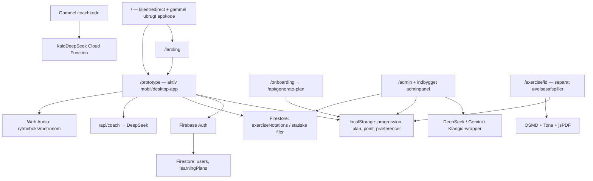

# Pocket Drummer — review og optimeringsplan

Dato: 13. september 2026. Gennemgået commit: `b9e6303b1ab4ef81902bf599b2ba2d6bd9dc98ef`.

Pocket Drummer er en Next.js/React-app med Firebase-login, delvis Firestore-persistens, browserlyd og eksterne AI-tjenester. Produktets stærkeste idé er at give voksne begyndere ét konkret næste øveskridt og synlig fremgang. Appen har et brugbart visuelt udgangspunkt, men indhold, progression og AI er endnu ikke sammenhængende nok til at indfri det løfte pålideligt.

**Vurdering: en funktionel prototype, der kræver stabilisering før en betalt lancering.** Det vigtigste arbejde er at få øvelse → gennemførelse → gemt fremgang → næste øvelse til at fungere som ét forløb. Flere funktioner eller et nyt design vil ikke i sig selv løse de fundne problemer.

Dette er en undersøgelse og plan. Ingen appkode, konfiguration, pakker eller lockfiler er ændret i projektet. Kun denne rapport og dens evidensbilag er tilføjet.

## Grundlag og verificering

Anvendte skills fra `/Volumes/SSD Data/Skills`:

- `app-review.skill`, læst som `app-review/SKILL.md` i arkivet: systemreview af logik, brugerrejser, sideeffekter, dataintegritet og UX.
- `react-app-qa.md`: SYSTEM-mode, herunder state, fejlhåndtering og tilgængelighed.
- `app-documentation.md`: formål, AI, dataflow, afhængigheder og acceptkriterier. Irrelevante solver- og prognoseafsnit er fravalgt.

Projektets `AGENTS.md` er læst. Relevante guides fra den installerede Next.js 16.2.6-pakke er læst i en midlertidig kopi: Route Handlers, public-folder og TypeScript-buildkonfiguration. Code Simplify er læst som supplerende reviewgrundlag; ingen refaktorering er udført.

| Kontrol | Resultat | Afgrænsning |
|---|---|---|
| Repository | Rent ved start; 37 TS/TSX-filer, ca. 14.991 linjer | Hertil kommer CSS, Functions, dokumenter og designreferencer |
| Installation | `npm ci --ignore-scripts --no-audit` gennemført i `/private/tmp` | Ingen pakker installeret i det rigtige projekt; install-scripts var slået fra |
| TypeScript | `tsc --noEmit --incremental false`: ingen fejl | Node 24.14.0, TypeScript 5.9.3 |
| Produktionsbuild | `npm run build`: bestået | Fiktiv Firebase-konfiguration; ingen AI-nøgler; ikke et deploymentbevis |
| Fuld lint | `npm run lint`: **10 fejl, 45 advarsler** | Designreferencer indgår i det nuværende lint-scope |
| Lint af app + Functions | `eslint src functions`: **7 fejl, 37 advarsler** | Én fejl handler om CommonJS-konfiguration, ikke defekt Functions-syntaks |
| npm-audit, hele hovedprojektet | **35 poster: 4 critical, 15 high, 15 moderate, 1 low** | Både direkte og transitive pakker, inklusive udviklingsværktøjer |
| npm-audit, hovedprojekt med `--omit=dev` | **8 poster: 2 critical, 5 high, 1 moderate** | Undervurderer browserens funktionelle afhængigheder, fordi jsPDF, Tone og OSMD står i devDependencies |
| npm-audit, Functions-lockfil | **17 poster: 2 critical, 8 high, 7 moderate** | Overlapper hovedprojektets pakker; tallene skal ikke summeres til unikke sårbarheder |
| Lokale handlerprober | Manglende auth, overskrivning, svag validering og falsk transskriptionsfallback reproduceret | Direkte kald til de faktiske route handlers; ingen angreb mod live-app |
| Firestore SDK-probe | `journey.lastExerciseId: undefined` afvises med `invalid-argument` | Lokal SDK-validering; ingen database blev skrevet |
| Browser | Desktop-gæst, teknikspor, øvelsespopup og mobil-landing undersøgt | Chrome, 1440×1000 og 390×844; ekstern netværkstrafik blokeret |

**Evidensniveauer i fundene:** *Reproduceret* betyder observeret i lokal kørsel; *kodefund* betyder fulgt gennem den aktuelle implementation; *leverandørverificeret* betyder kontrolleret i officiel dokumentation. Ingen af dem dokumenterer automatisk, hvad der aktuelt er deployed.

Ikke verificeret: rigtig login/session, konto A→B, Firestore-regler i emulator eller live, betalingsflow, faktiske AI-svar, videoernes tilgængelighed og faglige indhold, lydlatens på iPhone/Safari, Lighthouse/Core Web Vitals og cloudens faktiske IAM/secrets/billing. Den sidste udvidede browsertest af gennemførelse og coach blev afvist af automatisk godkendelseskontrol på grund af en forbrugsgrænse. Disse dele er derfor kodefund og fremtidige accepttests, ikke påstået gennemførte browsertests.

Rå npm-resultater, testresultater og udvalgte skærmbilleder ligger i [evidensbilaget](review-evidence-2026-09-13/README.md).

## Formål og anbefalet scope

`PRODUCT.md` og `CLAUDE.md` peger på samme primære målgruppe: voksne begyndere på 25–45 år, der øver hjemme og har begrænset tid. README beskriver derimod elever til øvede musikere, Claude og funktioner, som ikke svarer til den aktive app. Brug `PRODUCT.md` som facit ved næste revision.

Det konkrete produktløfte bør være: **“Jeg ved, hvad jeg skal øve i dag, kan gennemføre det og kan se min dokumenterede fremgang næste gang.”** Fremgang skal i første omgang betyde gennemførte sessioner, selvvurdering og opnået øvetempo. Der er ikke en aktiv pipeline, som lytter til brugerens trommespil og måler timing eller teknik; appen bør derfor ikke love objektiv færdighedsvurdering eller realtidsfeedback på spillet.

Anbefalet første sammenhængende release:

1. Én voksen begynderrejse med fagligt godkendte øvelser.
2. Et konkret dagsforslag med øvelses-ID, varighed, tempo og formål.
3. Noder/video og en stabil rytmeboks til samme øvelse.
4. Gennemførelse, valgfri selvvurdering og pålidelig genoptagelse på en anden enhed.
5. En coach, der forklarer og tilpasser et kendt øvelsesforløb med tydelig AI-status.

OMR og lydtransskription kan understøtte redaktørens indholdsarbejde. De behøver ikke være slutbrugerfunktioner ved første release. Bevar det selvstændige digitale trommesæt, hvis det hjælper nybegynderen; giv det lavere prioritet end øveforløbet. Fire sprog, avancerede teknikspor, App Store-wrapper og mere gamification bør følge dokumenteret brug og færdige kerneflows.

50 kr./md., segmentets betalingsvillighed og D30-retention som forretningsmål er arbejdsantagelser fra projektmaterialet. Der er ikke fundet data i repositoryet, som validerer dem. Planlæg korte observationer af 5–8 begyndere: kan de uden hjælp starte den rigtige øvelse, forstå hvad de skal gøre og finde den igen næste dag? Det er en foreslået produktkontrol, ikke en udført brugertest.

## Arkitektur og funktionelle afhængigheder

| Område | Faktisk status | Vigtigste afhængighed eller brud |
|---|---|---|
| Landing og navigation | Fungerer lokalt; query-parametre findes til tabs, kategorier, niveau og coach | Forskellig førstegangsadfærd efter viewport; øvelses-ID bæres ikke gennem alle flows |
| `/prototype` | Aktiv app på mobil og desktop | 4.961 linjer med UI, data, lyd, admin og navigation samlet |
| `/` | Redirecter til landing/prototype | Ca. 2.278 linjer gammel appkode ligger tilbage; `mounted` bliver aldrig true, så den gamle UI-gren vises ikke |
| Login | Google og e-mail er implementeret | Produktionens udbyderopsætning og domæner er ikke verificeret |
| Læringsrejse | Tre niveauer × fire teknikker × otte genererede trinkort | Kortene er ikke 96 selvstændigt verificerede lektioner |
| Kategoribibliotek | 15 poster i kategoridatasættet; 11 i PracticeScreen | Flere kopier og forskellige ID-systemer |
| Curriculum | 73 lektionsposter, heraf 26 gratis | Metadata fra et separat system; ikke dokumentation for 73 komplette aktive øvelser |
| Ældre øvelser | Otte `ex-*`-øvelser | Kun tre forskellige nodepatterns, når titel og tempo ignoreres |
| Notation | OSMD kan vise MusicXML; billeder/PDF kan gemmes som Firestore-data | Ingen statiske nodefiler i repositoryet; cloudindhold ikke undersøgt |
| Rytmeboks | Web Audio med BPM, underdeling, gap, backbeat og ramp | Swing er ikke koblet til lydplanlægningen |
| Studio Kit | Selvstændig `/drumkit`-side med Tone | Rytmeboks-knappen i hovedappen fører til metronom, selv om copy siger “Digitalt trommesæt” |
| Premium | Profilfelt og gammel simuleret checkoutkode | Ingen aktiv sammenhængende trial-, kvote- eller betalingsintegration |
| Native/offline | Webapp | Ingen Capacitor-projektstruktur eller service worker fundet |

## Afhængigheder: behold grundstakken, opdater kontrolleret

Versionerne nedenfor stammer fra lockfilerne. “Nyeste” er npm-opslag den 13. september 2026, ikke en instruktion om at opdatere alt samtidigt.

| Pakke | Låst | Nyeste observeret | Anbefaling |
|---|---:|---:|---|
| `next` | 16.2.6 | 16.3.5 | Høj prioritet: sikkerhedsopdater med matchende eslint-config; kontroller Firebase-adapteren |
| `react` / `react-dom` | 19.2.4 / 19.2.4 | 19.3.0 / 19.3.0 | Bevar som par; valider med valgt Next-version, audio og OSMD |
| `firebase` | 12.13.0 | 12.19.0 | Opdater efter auth/progressionsscenarier er defineret; modular SDK er passende |
| `lucide-react` | 0.475.0 | 1.45.0 | Lav prioritet; major-opdatering kræver ikon-/API-kontrol. Standardisér først brug af eksisterende ikoner |
| `react-markdown` | 10.1.0 | Ikke markeret outdated | Behold til coach; tilføj ikke rå HTML-rendering uden behov |
| `opensheetmusicdisplay` | 1.9.9 | 2.1.2 | Behold foreløbigt; major-opdater først mod et korpus af godkendte trommenoder |
| `tone` | 15.1.22 | Ikke markeret outdated | Behold, hvis den samlede lydmotor skal bruge Tone; undgå to parallelle timingmodeller |
| `jspdf` | 2.5.2 | 4.2.1 | Sikkerhedsopdater eller fjern sammen med ubrugt eksportflow; verificer PDF-layout efter opdatering |
| `firebase-tools` | 15.18.0 | 15.30.0 | Opdater separat som deployværktøj; ikke nødvendig i klientens runtime |
| `typescript` | 5.9.3 | 7.0.2 | Den nuværende checker består. Udskyd major-migration til efter stabilisering |
| `eslint` | 9.39.4 | 10.10.0 | Tilgængelig opdatering inden for nuværende interval: 9.39.5. Afstem med eslint-config-next før major |
| `eslint-config-next` | 16.2.6 | 16.3.5 | Følg den valgte Next-version |
| `@types/node` | 20.19.41 | 26.5.1 | Vælg typer til den valgte Node-runtime; ikke automatisk højeste major |
| `@types/react` / `@types/react-dom` | 19.2.15 / 19.2.3 | 19.3.0 / 19.3.0 | Følg React-parret |
| Functions: `firebase-admin` | 11.11.1 | 14.4.0 | Opdater sammen med Functions/runtime, eller fjern det separate Functions-spor hvis det pensioneres |
| Functions: `firebase-functions` | 7.2.5 | 7.3.2 | 7.3.2 accepterer Admin 14; nuværende 7.2.5 angiver kun Admin 11/12/13 som peers |

Vigtige nuancer:

- **Runtime:** begge package.json-filer og `.nvmrc` peger på Node 20. Node angiver nu 20 som EOL. Vælg en understøttet runtime på den faktiske hostingplatform; Node 22 er en dokumenteret fælles mulighed for Firebase Functions og Admin 14 kræver mindst 22. Testmiljøets Node 24 er ikke bevis for deploykompatibilitet. [Node EOL](https://nodejs.org/en/about/eol), [Firebase runtime](https://firebase.google.com/docs/functions/manage-functions).
- **Next.js:** 16.2.6 er i de berørte intervaller for aktuelle advisories. AVIF-problemet berører billedoptimering; en anden critical-advisory er Windows-specifik. Det beviser ikke, at netop denne Firebase-app kan udnyttes gennem begge angreb. Planen er opdatering plus vurdering af anvendte features. [Next.js AVIF-advisory](https://github.com/vercel/next.js/security/advisories/GHSA-2xp9-vwfh-vxw4).
- **jsPDF:** klassificeret critical i auditten, men eksempelvis filinklusion gælder Node-builds og bestemte API-kald. Appens aktuelle PDF-kode kører i browseren og bruger canvas. Der er derfor ikke dokumenteret serverfil-lækage her. Der er stadig flere advisories at rydde op i. [jsPDF-advisory](https://github.com/parallax/jsPDF/security/advisories/GHSA-f8cm-6447-x5h2).
- **Klassifikation:** `tone`, `opensheetmusicdisplay` og `jspdf` bruges af appen, selv om de står i devDependencies. Flyt dem til dependencies, hvis deres flows beholdes. Et `--omit=dev`-auditresultat er ikke dækkende for den reelle klientkode.
- **Transitive pakker:** gennemgå blandt andet `sharp`, `protobufjs`, `websocket-driver`, `tar` og Firebase CLI-kæder. Opdater deres ejende direkte pakker først. npm foreslår i ét tilfælde en gammel firebase-tools-major som “fix”; brug ikke `npm audit fix --force` ukritisk.
- **Omfang:** hovedlockfilen indeholder 1.198 pakkeposter, Functions 292. Det er ikke størrelsen på browserens bundle. Mål routens faktiske JavaScript før en dependency fjernes af performancehensyn.
- **Licenser:** de direkte pakkers lockmetadata angiver MIT, ISC, Apache-2.0 og BSD-3-Clause. Der er ikke udført en fuld transitiv licensaudit. Video-/node-/lydrettigheder skal føres som indholdsmetadata; npm-licenser dækker dem ikke.

## AI: hvad findes faktisk?

| Funktion | Model/logik og input | Output og faktisk integration | Vurdering |
|---|---|---|---|
| Aktiv coach | DeepSeek `deepseek-chat`; seneste 12 beskeder, sprog, niveau, teknik, journey | JSON med message og evt. action; UI viser kun message | Relevant, men øvelseskontekst/hukommelse og fejlkontrakt er mangelfuld |
| Separat Cloud Function | Samme model; anden prompt og ubeskåret klienthistorik | `kaldDeepSeek`, refereret af gammel coachkode | Dobbelt vedligeholdelse og mulig separat eksponering; deployed status ukendt |
| AI-læringsplan | DeepSeek; mål, niveau, minutter og tidshorisont | Fire ugers JSON-plan over de otte `ex-*`-øvelser | Kaldes fra `/onboarding`, ikke fra aktivt teknikspor |
| AI-nodegenerering | DeepSeek; titel, kategori, niveau, tempo, takter, fokus | MusicXML-tekst; adminpreview | Svag musikalsk validering; fallback leverer to takter uanset ønsket antal |
| OMR | Gemini `gemini-2.5-flash`; upload som base64 og MIME-type | MusicXML; server-timeout 60 sekunder | Nyttigt redaktørværktøj, men prompten tvinger 4/4 og kan ændre originalens taktart |
| Audio/YouTube | Klangio-wrapper; alternativt en selvhostet Basic Pitch-URL | MusicXML eller opdigtet standardtransskription | Ikke leveringsklar som pålidelig analyse |
| Lokalt “AI”-lag | Regler, statiske svar og skabeloner | Dagsforslag, erstatningsøvelser, nodepatterns | Kald det kurateret/regeldrevet indhold; det er ikke en model, der måler færdigheder |

Der er ingen Anthropic/Claude-integration i de gennemgåede aktive serverfiler og ingen Anthropic SDK i manifests. Der er heller ingen observeret RAG, vedvarende coachhukommelse, mikrofonbaseret færdighedsanalyse eller egne trænede modeller. Almindelige `fetch`-kald er tilstrækkelige til de nuværende behov; en større agentplatform eller flere AI-SDK'er er ikke i sig selv en optimering.

**Modellevetid kræver handling:** DeepSeeks officielle changelog annoncerer udfasning af `deepseek-chat` den 24. juli 2026. Koden bruger navnet fire steder. Den 10. september beskriver leverandøren `deepseek-flash` som det aktuelle Flash-modelnavn. Flyt modelvalg til serverkonfiguration og verificer en erstatning med egne trommefaglige eksempler, JSON-format og outputgrænser. Der er ikke foretaget et betalt live-kald for at måle den faktiske fejl. [DeepSeek changelog](https://api-docs.deepseek.com/updates/).

Googles kontrollerede modeltabel angiver ingen annonceret lukningsdato for `gemini-2.5-flash`. Den skal overvåges, men der er ikke grundlag her for at kalde den nedlukket. [Gemini-modellevetid](https://ai.google.dev/gemini-api/docs/deprecations).

Klangio-koden matcher ikke det dokumenterede API: koden bruger `/v1/transcribe`, Bearer-header, `id/jobId`, `PROCESSING/SUCCESS` og `/jobs/.../musicxml`; dokumentationen bruger `/transcription`, `kl-api-key`, `job_id`, `IN_PROGRESS/COMPLETED` og `/job/.../xml`. Dette skal repareres og kontrakttestes før funktionen loves brugerne. [Klangio workflow](https://api-docs.klang.io/docs/getting-started/basic-job-workflow).

Basic Pitch er et audio-til-MIDI-system til pitchtransskription. Repositoryet indeholder ikke den wrapper, der skal producere MusicXML eller klassificere trommeslag. Dets anvendelighed til netop trommesæt er derfor ikke dokumenteret. [Spotify Basic Pitch](https://github.com/spotify/basic-pitch).

Anbefalet AI-kontrakt: valideret input → autoriseret, budgetteret kald → valideret output → tydelig `source`/fejlstatus → eventuel faglig godkendelse. Log model, promptversion, varighed, tokenforbrug og fallbackårsag, uden rå samtaler som standard. Budgetter pr. bruger og job; inkluder retries og den separate Functions `minInstances: 1` i driftsomkostningen. Ingen faktiske forbrugsdata er tilgængelige til en troværdig kroneberegning nu.

## Konkrete fund

### 1. Logik, state og asynkrone forløb

**F01 · High — første rejse gemmes lokalt, men afvises af Firestore.**

Problem og årsag: `saveJourneyLocation` opretter et felt `lastExerciseId`, også når det er `undefined`. Firebase-konfigurationen ignorerer ikke undefined-værdier. `syncLearningPlan` skriver først lokalt og fanger derefter Firestore-fejlen uden at kaste den videre; `startJourney` kan derfor fortsætte som ved succes.

Evidens: `prototype/page.tsx:4515`, `authContext.tsx:209`, `firestoreService.ts:91`. Reproduceret i Firestore SDK: `Unsupported field value: undefined` i `journey.lastExerciseId`.

Planlagt rettelse: definer eksplicit “ikke startet”, udelad valgfrie felter før skrivning og returnér et reelt gemmeresultat. Adskil lokal kladde, gemmer og cloud-gemt; tilbyd genforsøg. Accept: start en ny rejse, genindlæs på en anden enhed, og se samme spor. Ved afvist skrivning vises gemmefejl, aldrig cloud-succes.

**F02 · High — gennemførelse, point og kontoidentitet har flere sandhedskilder.**

Problem og årsag: teknikspor kalder kun lokal `markCompleted`; kategorier skriver både lokal progression og brugerprofil; `/exercise/[id]` ændrer en tredje completion-liste. `syncCompletedExercises` opdaterer ikke `user.xp/level/streak`, selv om kategoriflowet netop har skrevet dem. Flere gennemførelser kan derfor beregne nye point ud fra samme gamle `user.xp`. Hele arrays overskrives, så to enheder kan miste hinandens ændringer. Lokale progressions-, XP- og sidste-øvedato-nøgler er ikke brugeropdelte og ryddes ikke alle ved logout.

Evidens: `prototype/page.tsx:679`, `:2259`, `:2290`; `authContext.tsx:89`, `:192`; `ExerciseClient.tsx:126`. Kodefund; konto- og flerenhedsscenarier ikke kørt live.

Planlagt rettelse: fælles `completeExercise` med stabilt øvelses-ID og sessions-ID, idempotent serverskrivning og opdatering fra det bekræftede resultat. Brug UID-opdelt lokal cache; behandl gæstemigrering særskilt. Accept: to gennemførelser giver forventede point, dobbeltklik giver ikke dobbelt belønning, konto B ser ikke konto A's lokalstatus, og to enheder kan gennemføre uden tab.

**F03 · High — “næste trin” bruger sidst åbnet som gennemført.**

Problem og årsag: `openExercise` registrerer `lastExerciseId` ved åbning. Home viser `lastExerciseId + 1`; genoptagelsesknappen åbner derimod det gamle ID. Åbning af trin 8 kan give teksten “Trin 9 af 8”, selv uden gennemførelse. Dagsforslaget bruger ikke en daglig plan eller sessionens faktiske afslutning.

Evidens: `prototype/page.tsx:880`, `:2082`, `:2091`, `:4593`. Kodefund.

Planlagt rettelse: adskil `lastOpenedExerciseId`, `completedExerciseIds` og det afledte næste trin. Accept: åbning og lukning springer ingen øvelse over; fuldført trin 8 viser afsluttet spor og et defineret næste valg.

**F04 · Medium — rytmeboksens swing har ingen effekt; timing er bundet til UI-tråden.**

Problem og årsag: swing-state ændrer procentvisningen, men indgår ikke i `schedule` eller dependencies. Lyde startes ved `AudioContext.currentTime` fra `setInterval`; UI-arbejde kan dermed forsinke slag. I øvelsespopup oprettes lyd endda inde i en React-state-updater, som bør være ren.

Evidens: `prototype/page.tsx:1624`, `:3116`, `:3184`, `:3453`. Manglende swingkobling er kodebevist; faktisk timingjitter er ikke målt.

Planlagt rettelse: én fælles lydmotor med forudplanlagte audio-tidspunkter og separat UI-markering. Implementer swinginterval eller skjul slideren. Accept: mål output ved 60/120/200 BPM under UI-belastning; 50 % og 66 % swing skal give forskellige dokumenterede tidsafstande. Efter stop/navigation må ingen oscillator eller timer fortsætte.

### 2. Brugerrejser og produktløfte

**F05 · High — den lovede personlige fireugersplan styrer ikke hovedappen.**

Problem og årsag: `/onboarding` genererer en plan over `ex-*` og gemmer den lokalt. Det aktive teknikspor bygger trinkort og egne standardøvelser og kalder ikke `/api/generate-plan`. Mål, tidsbudget og faktisk plan afgør derfor ikke konsekvent “I dag”. De to flows bruger også forskellige datoformater.

Evidens: `onboarding/page.tsx:57`, `:81`; `prototype/page.tsx:2067`, `:4481`; `ai.ts:21`.

Planlagt rettelse: vælg ét fælles planformat og én adgang til onboarding. Lad en deterministisk plan over godkendte øvelser være robust grundlag; AI kan forklare og foreslå tilpasninger inden for samme format. Accept: ændret tidsbudget ændrer dagsprogrammet; hvert plan-ID åbner den rigtige aktive øvelse; en gemt plan bruges på Home og af coachen.

**F06 · High — coachen får niveau, men hverken den aktuelle øvelse eller vedvarende hukommelse.**

Problem og årsag: API og CoachScreen understøtter `currentExercise`, men de to mounts af CoachScreen sender ikke `currentExerciseTitle`. Chatten bor i komponent-state og forsvinder ved unmount. API'et modtager klienthistorik frem for at hente brugerhistorik. Returnerede `action`-objekter kasseres, og UI'et tjekker ikke `res.ok`, så 429/500 kan blive til et generisk svar.

Evidens: `prototype/page.tsx:3471`, `:3518`, `:4720`, `:4924`; `api/coach/route.ts:153`, `:203`. Kodefund; sidste udvidede browsertest blev ikke gennemført.

Planlagt rettelse: send det valgte kanoniske øvelses-ID fra øvelsespopup; hent verificeret profil og progression serverside. Gem et kort, brugerbundet resumé med mulighed for nulstilling. Valider og render en reel øvelseshandling. Accept: “hjælp til denne øvelse” nævner præcis den åbne øvelse, tidligere kontekst kan genoptages, og API-fejl vises med mulighed for genforsøg.

**F07 · High — indholdstitler, video og noder kan beskrive forskellige øvelser.**

Problem og årsag: alle genererede teknikspor sender kategorien `opvarmning` og ID 1–8 til medieopslag. Eksempelvis kan forskellige niveauer og teknikker dermed læse samme `exerciseNotations/opvarmning_1` og video. ID'er ud over videoarrayets længde klemmes til sidste video. `ex-1` og `ex-4` har samme nodepattern, selv om sidstnævnte hedder Paradiddle; flere groovegenrer deler også standardmønster. PracticeScreen har 11 poster, kategorier 15, curriculum 73, og ingen statiske nodefiler er med i repoet.

Evidens: `prototype/page.tsx:723`, `:749`, `:1578`, `:2067`, `:2259`; `mockData.ts`; `presetExercises.ts`. Tre nodepatterns blandt otte startøvelser er reproduceret. Teknikpopup/videoopslag er observeret lokalt; videoens indhold er ikke vurderet.

Planlagt rettelse: ét øvelsesregister med ID, fagligt mål, teknik, niveau, node-/video-/audioasset, status og kilde. Publikér kun validerede kombinationer. Accept: paradiddle viser korrekt sticking; hver øvelse har passende materiale eller ærlig tomtilstand; indholdsantal afledes af publicerede poster.

**F08 · Medium — mobilens admin-knap åbner ikke det indbyggede adminpanel.**

Problem og årsag: mobilens TabBar sætter `adminOpen`, men `<AdminPanel>` renderes kun i desktopgrenen. De enkelte øvelsers uploadpaneler er separate flows.

Evidens: `prototype/page.tsx:4733`, `:4895`. Kodefund; adminlogin ikke kørt.

Planlagt rettelse: fælles overlay-rendering eller entydig navigation til `/admin`. Accept: en admin kan åbne samme indholdsadministration ved 390 px, 820 px og desktop; ikke-admin får 403 på serverhandlinger.

### 3. Manglende kontrol og sideeffekter

**F09 · Critical — betalte AI- og filoperationer mangler serverautorisation.**

Problem og årsag: ingen af de syv Next API-ruter verificerer Firebase ID-token eller adminrolle. En UI-guard på `/admin` beskytter ikke ruterne. `save-notation` kan skrive vilkårlig tekst og overskrive samme normaliserede filnavn; `save-sheet-image` accepterer klientens MIME-type. Den separate Cloud Function har heller ingen identitetskontrol i koden.

Evidens: `src/app/api/*/route.ts`, `functions/index.js:41`. Reproduceret: anonyme coach/generate-kald; anonym lagring og overskrivning i en midlertidig notation-mappe. Sanitiseret filnavn begrænser path traversal, men giver ikke adgangskontrol. Faktisk live-eksponering er ikke undersøgt.

Planlagt rettelse: fælles tokenvalidering, roller og adgangskrav pr. rute. Coach/plan kræver defineret bruger-/gæstepolitik; upload, scanning, nodegenerering og publicering kræver serververificeret redaktør/admin. Luk eller beskyt den gamle Cloud Function separat. Accept: anonymt kald giver 401, almindelig bruger til adminoperation giver 403, og afvisning sker før leverandørkald eller filskrivning.

**F10 · High — ratebegrænsning og omkostningskontrol er ufuldstændig.**

Problem og årsag: fem ruter bruger en proceslokal IP-Map; `save-sheet-image`, `transcribe-audio` og Cloud Function mangler tilsvarende kontrol. Map deles ikke mellem instanser og nulstilles ved genstart. IP hentes fra første `x-forwarded-for` uden dokumenteret proxy-tillidsgrænse. Body-/token-/filgrænser er ujævne, og DeepSeek-kald mangler timeout.

Evidens: `apiSecurity.ts:8`, `:22`; API-ruterne; `ai.ts`; `functions/index.js`. Header-skift giver nyt budget i lokal probe; om produktionsproxyen tillader spoofing er ikke verificeret.

Planlagt rettelse: vedvarende atomisk kvote pr. UID og operation, globalt forbrugsloft, body-/fil-/beskedgrænser og total tidsgrænse. IP/App Check kan supplere brugeridentitet. Accept: kvoten holder på tværs af instanser og retries; for stor upload afvises tidligt med 413; fejlbudgettet begrænser providerforbrug.

**F11 · High — “gem/publicér øvelse” publicerer ikke et fælles katalog.**

Problem og årsag: `/admin` gemmer nye øvelser i browserens localStorage med `godkendt: true`. Den aktive app bruger hardkodede datasæt. Andre brugere får ikke automatisk øvelsen. `save-notation` skriver til serverens lokale `public`-mappe, som mangler ved checkout; en cloudinstans er heller ikke en vedvarende delt filbutik.

Evidens: `admin/page.tsx:457`, `mockData.ts:331`, `api/save-notation/route.ts:25`. Manglende mappe giver reproduceret ENOENT/500.

Planlagt rettelse: fælles katalog i Firestore og assets i objektlager; kladde → fagligt review → publiceret med version. Opdater eller invalidér katalogvisning efter publicering. Accept: materiale oprettet af admin kan læses af en anden bruger/enhed og overlever ny deploy; gammel version kan genskabes.

**F12 · High — abonnementsrettigheder er ikke et samlet system.**

Problem og årsag: Firestore beskytter i højere grad `isPremium`, men appen har ingen aktiv betalingsudbyder, verificeret webhook, trialstart/udløb eller serverkvoter for premium. `syncPremiumStatus` forsøger stadig klientskrivning, selv om reglerne afviser opgradering. Den simulerede checkout i `/` er ubrugt og må ikke tælles som implementeret betaling.

Evidens: `firestore.rules:27`, `authContext.tsx:223`, `app/page.tsx:1992`, `:2139`; manifests og API-ruteregister.

Planlagt rettelse: beslut gratis adgang og triallængde; opret serverstyret entitlement med start, udløb og status. Tilslut valgt betalingsflow, webhook-idempotens, annullering og genoprettelse. Accept: betaling, fortrydelse/annullering og udløb ændrer adgang korrekt på ny enhed. localStorage ændrer aldrig serverrettigheder. Udskyd købsknapper, til det er reelt implementeret.

**F13 · Medium — sletning, datalivscyklus og produktmåling mangler.**

Problem og årsag: ingen sammenhængende kontosletning/eksport eller oprydning af profil, plan og fremtidige sessioner/assets er fundet. Lokale noter/tilstand kan overleve logout. Der er heller ingen events, der gør D30-retention eller faktisk øvetid målbar. Landing har ingen synlige privatlivs-/vilkårslinks i det gennemgåede flow.

Evidens: authContext, Firestore-regler, layout, landing og søgning i src. Dette er konstateringer om funktioner og dokumentation, ikke en juridisk konklusion om compliance.

Planlagt rettelse: kortlæg datafelter, formål, modtagere og opbevaring; implementer eksport/sletning og fejlgenoptagelig oprydning. Dokumentér Firebase, DeepSeek, Gemini, eventuel Klangio, YouTube og eksterne skrifter. Definer session-events før pilot. Accept: slettet konto kan ikke genskabe persondata fra cache; samtlige afledte poster er håndteret; retention kan beregnes fra faktiske sessioner.

### 4. Dataintegritet og eksterne kontrakter

**F14 · High — AI-input og -output valideres ikke som runtime-data.**

Problem og årsag: TypeScript-interfaces validerer ikke JSON ved grænsen. Ukendt niveau, negativ øvetid og et objekt som tidshorisont accepteres. Coach antager et array og kan kaste før sin try/catch. Klienten kan sende ikke-tilladte chatroller eller indsætte instruktioner i “reelle” kontekstfelter. Plan-JSON kontrolleres ikke for kendte IDs, dag/uge eller varighed; XML kontrolleres primært med tekstudtræk og preview.

Evidens: `generate-plan/route.ts:15`, `generate-music/route.ts:15`, `coach/route.ts:210`, `ai.ts:72`, `musicXml.ts:1`. Reproduceret: ugyldig plan giver 200; `messages` som objekt giver `messages.slice is not a function`.

Planlagt rettelse: fælles schemas med tilladte roller, længder, enums og endelige tal; valider providerrespons før brug. XML skal parses, have tilladte strukturer, korrekt taktsum, instrumentkort og forventet taktantal. Behandl brugerindhold som data, også i systemkontekst. Accept: ugyldige inputs giver 400; ukendte øvelses-ID'er eller trunkeret XML afvises; provideroutput kan ikke skabe ugyldig plan.

**F15 · High — fallback kan udgive skabeloner for analyseret materiale.**

Problem og årsag: ved manglende nøgle eller providerfejl svarer coach/plan/musik ofte 200 med fallback uden en maskinlæsbar kilde. Lydfallback modtager ikke selve lyddata, men logger alligevel Demucs-separation, detekteret 104 BPM og “0 fejl”. OMR returnerer en demo-node ved manglende nøgle, selv om anden fejlcopy siger, at der ikke vises upræcise fallbacknoder.

Evidens: `transcriptionService.ts:197`, `gemini.ts:18`, `ai.ts:25`, `:155`; `coach/route.ts:223`. Reproduceret med ugyldige lydbytes: 200, MusicXML og de opdigtede analyseudsagn. 32 ønskede takter giver to i musikfallback.

Planlagt rettelse: adskil AI-genereret, kurateret og demoresultat med `source`, model og status. Analyse, der ikke har kørt, må ikke levere opdigtede måleresultater. Accept: uden nøgle vises “analyse utilgængelig” eller eksplicit demo; ingen gemt node mærkes transskriberet uden faktisk inputbehandling.

**F16 · High — modelnavn og transskriptionskontrakt er forældet.**

Problem og årsag: `deepseek-chat` bruges trods leverandørens udfasningsmeddelelse; Klangio-request, headers, jobfelter og statusværdier afviger fra dokumentationen. Fejlene kan skjules af F15's fallback.

Evidens: `ai.ts:47`, `:126`, `coach/route.ts:172`, `functions/index.js:67`, `transcriptionService.ts:82`. Leverandørverificeret som beskrevet i AI-afsnittet; ikke live-kaldt.

Planlagt rettelse: konfigurerbare modelnavne og små kontrakttests mod valgte providers. Klangio bør bruge et gemt job-ID og polling/webhook uden at binde hele jobbet til én lang HTTP-request. Accept: et kendt kort trommeklip giver et rigtigt provider-job og hentbart MusicXML; providerfejl bliver synlige, ikke erstattet af et “succes”-resultat.

**F17 · High — binært materiale gemmes i Firestore-dokumenter.**

Problem og årsag: adminpaneler base64-koder billeder/PDF'er og skriver dem direkte som `dataUrl`. Firestore har en dokumentgrænse på 1 MiB; base64 gør payloaden ca. en tredjedel større. En fil omkring 768 KiB plus metadata kan derfor overskride grænsen. Lister henter hele notationsdokumenter, også når de kun skal vise status. Gæster må ikke læse `exerciseNotations`, mens UI giver adgang til gæsteøvelser.

Evidens: `prototype/page.tsx:1662`, `:1690`, `:4130`, `:4167`; `firestore.rules:46`. Størrelsesgrænsen er [leverandørverificeret](https://firebase.google.com/docs/firestore/quotas); store clouduploads er ikke kørt.

Planlagt rettelse: objektlager til filer, kun metadata/referencer i Firestore og tilsvarende Storage-regler. Gør gratis/publiceret indholds læsepolitik entydig. Accept: godkendt 5 MB PDF kan uploades, læses af berettiget bruger og slettes igen; kataloglæsning downloader ikke hele PDF'en.

**F18 · High — runtime og sikkerhedsopdateringer mangler en releasekontrol.**

Problem og årsag: Node 20 er fastholdt, manifests og lockfiler har aktuelle advisories, og build springer TypeScript-kontrollen over. Der er ingen testscript/CI-pipeline i repositoryet. Lint af designarkivet og CommonJS-Functions giver desuden støj, der er forskellig fra appfejl.

Evidens: `package.json`, `functions/package.json`, `.nvmrc`, `next.config.mjs:3`, `eslint.config.mjs` samt udførte kontroller. TypeScript består aktuelt; problemet er den manglende fremtidige releasegate.

Planlagt rettelse: valgt understøttet Node, kontrolleret opdatering af direkte/transitive pakker, `ignoreBuildErrors: false`, klart lint-scope og egne passende regler for Functions. Tilføj få forretningskritiske tests frem for tests af trivielle komponenter. Accept: reproducerbar CI-installation, typecheck, lint, build og kritiske scenarier skal bestå før release; resterende advisories har dokumenteret disposition.

### 5. UX, ærlig kommunikation og vedligeholdelse

**F19 · High — appen viser opdigtet fremgang til nye brugere.**

Problem og årsag: guest XP starter på 120; Home falder tilbage til tre streakdage, profilen til syv for brugere uden feltet; ugeoversigter viser faste minutter. “Fortsæt hvor du slap” er også statisk. Landing fremsætter udokumenterede udsagn om gennemsnitlig øvetid, fremgang og eksisterende founding members.

Evidens: `prototype/page.tsx:874`, `:1119`, `:1297`, `:3680`, `:4355`; landing. Reproduceret i frisk browser: “3 dage i streg”, “3 øvedage · 72 min” og “Sekstendedele · timing”.

Planlagt rettelse: tomme konti starter med nul og en hjælpsom introduktion. Afled alle tal fra samme sessionsdata; skil aktivitet fra påvist færdighed. Fjern eller dokumentér marketingtal. Accept: ny konto viser ingen tidligere øvning; et afsluttet forløb ændrer kun de relevante tal.

**F20 · Medium — flere synlige kontroller er ikke koblet til den lovede handling.**

Problem og årsag: øvelsespopup har Loop og Næste uden handler. Valg af en specifik øvelse i PracticeScreen åbner kategorien i stedet for øvelsen. Play-along-motoren har setters, som ikke bruges; den starter derfor ikke via disse states. `/exercise/[id]` afspiller syntetiske kategorimønstre frem for MusicXML; fillgrenen kræver `step >= 8`, mens step altid er modulo 8. Videotid simuleres frem for at læses fra afspilleren.

Evidens: `prototype/page.tsx:1469`, `:2000`, `:2352`; `ExerciseClient.tsx:91`, `:214`, `:251`. Kodefund; konkret lydoutput ikke optaget.

Planlagt rettelse: fjern uvirksomme kontroller eller bind dem til én afspiller med faktiske node-/medietidspunkter. Accept: øvelsesklik åbner valgt ID, Næste åbner defineret næste øvelse, Loop gentager valgt interval, og det hørte pattern svarer til den viste node.

**F21 · Medium — WCAG-målet er ikke dækket af de aktuelle komponenter.**

Problem og årsag: kategorirækker er klikbare divs uden tastatursemantik; coachikon og flere ikonknapper mangler navne; overlays mangler dialogrolle/fokusstyring. Flere kontroller er under projektets 44×44-mål. Der er delvis reduced-motion-støtte, men den dækker ikke alle animationer. Flersproget UI blander oversatte og faste danske tekster.

Evidens: `prototype/page.tsx:1749`, `:1935`, `:2642`, `:3639`, `:4086`; `globals.css`. Browseren fandt ingen dialogrolle på den åbne øvelsespopup. Fuld kontrast-, skærmlæser- og zoomaudit er ikke udført. `languageContext` opdaterer faktisk dokumentets lang-attribut; dét skal bevares.

Planlagt rettelse: fælles button/dialog/slider-komponenter med navne, fokus, Escape og touchmål. Test 200 % zoom, tastatur og skærmlæser på kerneflowet; saml oversættelserne. Accept: en bruger kan åbne, betjene og lukke øvelsen uden mus, og fokus vender tilbage til udgangspunktet.

**F22 · Medium — gammel kode og dobbelte systemer gør ændringer unødigt risikable.**

Problem og årsag: aktive 4.961 linjer i prototype, 2.278 linjer hovedsageligt ubrugt rod-app, separat curriculum, tre øvelsessystemer, flere coach-/adminflows og forskellige tokens. De er lette at forveksle med aktive features; det skete også i første orientering af dette review og er korrigeret her.

Evidens: `app/page.tsx:2139`, `prototype/page.tsx`, `curriculum.ts`, `mockData.ts`, `FloatingCoach.tsx`, `functions/index.js` og designfiler.

Planlagt rettelse: besluttet rutekort og katalog først; derefter fjern eller arkivér bekræftet ubrugt kode. Udtræk domænelogik for katalog, progression, lyd og AI før kosmetisk opdeling af JSX. Bevar fungerende Next.js/Firebase-arkitektur. Accept: ét sted afgør øvelse, niveau og completion; gammel checkout/coach kan ikke ved et uheld blive produktionsfunktion.

**F23 · Medium — performance og driftssetup bør måles og forenkles.**

Problem og årsag: global CSS importerer otte fontfamilier med mange vægte fra Google. NotationRenderer giver en ny `onLoadStatus={() => {}}` ved render; OSMD-effekten afhænger af callbacken og kan genindlæse noder ved taktskift. Async OSMD-load har ikke en instans-/generationskontrol. Hosting er framework-aware Firebase Hosting med `us-central1`; den separate coach holder mindst én instans varm. `npm start` bruger `next start`, mens konfigurationen er standalone, og lokal start udsendte advarsel om at bruge standalone-serveren.

Evidens: `globals.css:1`, `prototype/page.tsx:498`, `OsmdRenderer.tsx:18`, `firebase.json`, `functions/index.js:42`, `package.json`. Der er ikke målt produktionslatens eller faktiske omkostninger.

Planlagt rettelse: mål ruterne før/efter; begræns fonte og vægte, gør callback/OSMD-livscyklus stabil, og lazy-load tunge værktøjer ved behov. Dokumentér build/start/assets/secrets og evaluer hostingadapterens support. Firebase beskriver framework-aware Hosting som preview; et skifte til App Hosting er en separat beslutning, ikke nødvendigvis første rettelse. [Firebase Hosting-status](https://firebase.google.com/docs/hosting/frameworks/frameworks-overview).

Accept: ingen OSMD-reload ved ren cursorændring; gentagen åbning/lukning efterlader ikke renderer/lydressourcer; valgt startkommando virker i samme artifact som deployment. Mål kold start, transferred JS, LCP/INP og providerlatens på relevant mobilnet før der sættes realistiske budgets.

## Genkontrol af tidligere audits

| Tidligere punkt | Status i denne kode | Konsekvens |
|---|---|---|
| Enhver bruger kan oprette sig som admin | Create-reglen kræver nu user-rolle eller eksisterende adminadgang | Den tidligere konkrete create-fejl skal ikke rapporteres som uændret; emulator-tests mangler |
| Premium styres kun af localStorage | Delvist forbedret: profilfelt og regler beskytter opgradering | Entitlement/betaling er stadig ufuldstændig, jf. F12 |
| Ingen rate-limit på API'er | Fem Next-ruter har nu en lokal begrænsning | F09/F10 beskriver det resterende problem præcist |
| Home har kun statisk dagsøvelse | Anbefaling bruger nu journey | Åbnet/gennemført og plan kobles stadig forkert, jf. F03/F05 |
| Teknikplan har tom øvelsesliste | Standardliste er tilføjet | Det er stadig ikke den AI-plan, som styrer aktivt spor |
| Coach får intet niveau | Niveau, teknik og journey sendes nu | Aktuel øvelse, serverdata og vedvarende hukommelse mangler |
| Fem TypeScript-fejl | Ikke reproduceret: checker består | Fjern forældet advarsel i projektkontekst |
| Preview-toggle altid synlig | Toggle kræver nu previewMode/query | Almindeligt gæsteforløb viste ikke toggle; gammel copy/kode kræver særskilt oprydning |
| Gammel desktopcheckout er aktiv | Nej: rodkomponenten redirecter og bliver i loading-grenen | Behandl som ubrugt kode, ikke som aktivt betalingsflow |

## Implementeringsplan til senere

Rækkefølgen er afhængighedsstyret. Estimaterne er grove udviklerdage for én erfaren udvikler; de er ikke tilbud og omfatter ikke større indholdsproduktion, betaling/native-review eller ventetid på udbydere.

| Fase | Arbejde og leverance | Afhænger af | Omfang | Exitkriterium |
|---|---|---|---|---|
| 0 · Beslutninger | Lås kanonisk app/rutekort, øvelses-ID, gratis/trialmodel, mål for første release og hvad der regnes som gennemført | Denne rapport | 1–2 dage | Én kort beslutningsspec og repræsentative øvelser som facit |
| 1 · Sikker drift | F09, F10, F14, F15, F16, F18: auth/admin, kvoter, payloadgrænser, ærlige fejl, modelkonfiguration og sikkerhedsopdateringer | Fase 0's adgangspolitik | 4–8 dage | Anonyme/ulovlige operationer afvises; kendt legitimt kald fungerer; build/typecheck/lint er gates |
| 2 · Progression | F01–F03, F19: fælles completion/session-model, cloud-gemning, lokal cache pr. bruger, idempotens og rigtige tal | Fase 0, serveradgang fra fase 1 | 4–7 dage | Ny bruger → øvelse → afslut → genindlæs/anden enhed → korrekt næste trin |
| 3 · Indhold og afspiller | F07, F08, F11, F17, F20: katalog, redaktørstatus, objektlager, korrekt mediekobling og fælles spiller | Katalog-ID og progression | 5–10 dage + fagligt indholdsarbejde | Ét komplet begynderforløb kan gennemføres; noder/lyd/video matcher |
| 4 · Personlig plan og coach | F05, F06: plan over kanonisk katalog, verificeret øvelseskontekst, resumé/historik og anvendelige handlinger | Fase 2–3 | 3–6 dage | Plan, Home og coach bruger samme aktuelle øvelse; fallback er testet |
| 5 · Pilotklar kvalitet | F04, F13, F21, F23: lydmålinger, a11y, datahåndtering, events og driftskontrol | Sammenhængende kerneflow | 3–6 dage | Pilotens acceptmatrix består på desktop og fysisk mobil |
| 6 · Betalt release | F12, faktuel marketing, betalingslivscyklus og driftsberedskab | Pilot og beslutning om betalingskanal | Estimér efter kanalvalg | Adgang følger bekræftet abonnement/trial; support, sletning og rollback er afprøvet |

F22's oprydning udføres i små trin sammen med de relevante faser. Samlet stabiliseringsarbejde før betaling er groft **20–39 udviklerdage**, afhængigt af genbrug og fund under integration. Planen bør genestimeres efter fase 0 og de første kritiske datatests. En bred UI-omskrivning, native-wrapper og nye AI-features ligger uden for det estimat.

Foreslået datagrundlag for fase 2–4:

- `exercises/{id}`: publiceret version, teknik/niveau, varighed/BPM, assets, faglig godkendelse og kilde.
- `users/{uid}/sessions/{sessionId}`: øvelses-ID/version, start/slut, faktisk øvetid, BPM og valgfri selvvurdering. Unikt sessions-ID giver idempotens.
- `learningPlans/{uid}` eller en versioneret planstruktur: stabile øvelsesreferencer, datoer, dagligt tidsbudget og forklaring på valg.
- Brugerprofil/aggregat: afledt completion, point og streak med defineret lokal kalenderdato/tidszone. UTC-`slice(0,10)` bør ikke alene afgøre en dansk aftensession.
- Serverstyret entitlement: trial/subscription/kvoter. Et brugerredigerbart præferencefelt må ikke også være adgangsbevis.

Der er ikke behov for at skifte database eller indføre mikroservices for at etablere dette.

## Acceptmatrix før implementering kaldes færdig

| ID | Scenarie | Forventet resultat | Kontrol |
|---|---|---|---|
| AC01 | Frisk gæst åbner appen | Nul historik; ét rigtigt begynderskridt | Browser på mobil/desktop |
| AC02 | Første rejse uden tidligere trin-ID | Gyldig cloudplan; ingen undefined-fejl | SDK/emulator + anden enhed |
| AC03 | Firestore afviser gemning | Synlig gemmefejl og genforsøg; ingen falsk succes | Fejlinjektion |
| AC04 | Øvelse åbnes og lukkes | Næste anbefaling hopper ikke frem | Integrationstest |
| AC05 | Trin 8 afsluttes | Afsluttet spor; aldrig trin 9/8 | Domæne-/flowtest |
| AC06 | Dobbeltklik, retry, samtidige sessioner | Samme completion/belønning én gang pr. defineret hændelse | Emulator/integration |
| AC07 | Konto A logger ud; konto B logger ind | Ingen krydskontohistorik eller lokal entitlement | Browser + emulator |
| AC08 | To enheder øver forskelligt | Begge afslutninger bevares | Integration |
| AC09 | Anonym/normal bruger kalder adminrute | 401/403 inden dyrt arbejde | API-test |
| AC10 | Kvoten nås på to serverinstanser | Fælles kvote; 429 med meningsfuld UI-fejl | Integration |
| AC11 | Provider timeout, ugyldigt JSON/XML, ingen nøgle | Tydelig status, intet opdigtet analyseresultat | Providerstub + kontrolleret smoke-test |
| AC12 | “Hjælp til denne øvelse” | Coach bruger faktisk øvelses-ID/niveau og åbner gyldig handling | Integration/browser |
| AC13 | Coach lukkes og åbnes igen | Aftalt historik/resumé bevares pr. bruger | Browser |
| AC14 | Forkert niveau/negativ tid/systemrolle/for stor fil | 400/413; ingen provideromkostning | API-tests |
| AC15 | Admin publicerer node og 5 MB PDF | Tilgængelig på anden enhed og efter deploy | Integration + staging |
| AC16 | Paradiddle, single stroke, shuffle og 3/4-node | Titel, sticking, taktart, visning og lyd stemmer | Trommefagligt korpusreview |
| AC17 | Loop/Næste/tempo/swing bruges | Kontrollerne påvirker den korrekte afspiller | Browser + lydmåling |
| AC18 | Tastatur, 200 % zoom, skærmlæser, reduced motion | Komplet kerneflow uden blokering | Manuel a11y-kontrol |
| AC19 | Abonnement købes, udløber eller annulleres | Serverrettigheder og UI stemmer på alle enheder | Betalings-sandbox |
| AC20 | Konto slettes/eksporteres | Dokumenteret håndtering af data og cache | Integration |
| AC21 | Ren installation på valgt runtime | Typecheck, lint, build og start fungerer | CI/staging |
| AC22 | Pilotdata undersøges | Sessionsantal og retention kan reproduceres uden hardkodede tal | Event-/datakontrol |

AI-kvalitet bør bedømmes på et lille fast korpus før modelskifte: mindst begynderspørgsmål, øvelsesafhængige spørgsmål, ukendt øvelse, ugyldige input, providerfejl, dansk fagsprog og flere node-/taktarter. Et korrekt JSON-svar tæller ikke som fagligt korrekt undervisning. Lad en trommekyndig godkende node-/øvelsesmaterialet.

Måling til pilot: `practice_started`, `practice_completed`, øvelses-ID/version og faktisk aktiv øvetid. Definér D30-retention på forhånd, fx andel af brugere med første afsluttede session i en kohorte, som afslutter mindst én session på dag 30. D7, sessioner pr. uge, completionrate og tid til første øvelse er støtteindikatorer. Point og AI-chatbeskeder er ikke i sig selv evidens for, at brugeren bliver bedre til trommer.

## Samlet prioriteret fundliste

| Fund | Problem | Severity | Område |
|---|---|---|---|
| F09 | API- og filoperationer uden serverautorisation | Critical | Sikkerhed/sideeffekter |
| F01 | Første cloudrejse afvises, fejl skjules | High | Logik/persistens |
| F02 | Splittet completion, point og brugerdata | High | Dataintegritet |
| F03 | Sidst åbnet behandles som gennemført | High | Progression |
| F05 | AI-plan styrer ikke aktivt øveforløb | High | Brugerrejse |
| F06 | Coach mangler øvelseskontekst og hukommelse | High | AI/brugerrejse |
| F07 | Titler, video, noder og kataloger stemmer ikke | High | Indhold |
| F10 | Ufuldstændige kvoter og omkostningsgrænser | High | Drift/sikkerhed |
| F11 | Adminpublicering er lokal/ikke vedvarende | High | Publicering |
| F12 | Trial/betaling/entitlement er ikke samlet | High | Forretning/adgang |
| F14 | Manglende runtimevalidering af AI-data | High | Dataintegritet |
| F15 | Fallback udgiver skabeloner for analyse | High | AI/troværdighed |
| F16 | Udfaset modelnavn og forkert providerkontrakt | High | Afhængigheder/AI |
| F17 | Store filer i Firestore-dokumenter | High | Lagring |
| F18 | Runtime/advisories og manglende releasegates | High | Afhængigheder |
| F19 | Opdigtede fremskridts- og marketingtal | High | Produktløfte |
| F04 | Swing uden effekt; UI-bundet lydtiming | Medium | Lyd |
| F08 | Mobiladmin-knap uden panel | Medium | Brugerrejse |
| F13 | Sletning, dataforløb og måling mangler | Medium | Sideeffekter |
| F20 | Kontroller og afspilning matcher ikke løftet | Medium | UX/lyd |
| F21 | Manglende a11y-semantik og fokushåndtering | Medium | Tilgængelighed |
| F22 | Ubrugt kode og parallelle systemer | Medium | Arkitektur |
| F23 | Fonte, renderer og drift bør forenkles/måles | Medium | Performance/drift |
